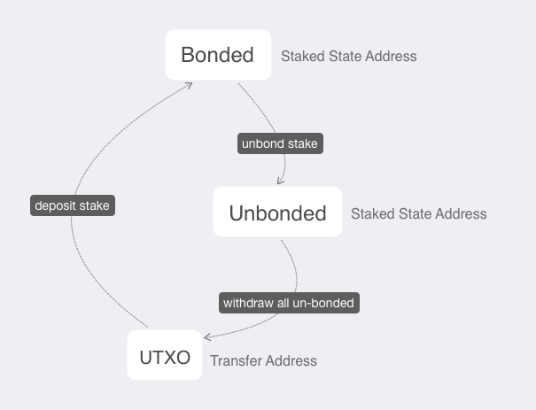

# Send Your First Transaction

 Before doing any transaction, It is noted that, the genesis fund is **bonded** (or staked) at the beginning. To move funds freely around, we first have to withdraw it to UTXO:

 

## Restore the Default wallet
From the getting started section, we have already kicked off the Crypto.com Chain with the 
simple make commands and docker. However, there is multiple [tendermint configs](https://github.com/crypto-com/chain/tree/master/docker/config/devnet/tendermint) should be explained.

First, the genesis fund is [stored](https://github.com/crypto-com/chain/blob/master/docker/config/devnet/tendermint/genesis.json#L19) in a pre-created Hierarchical Deterministic(HD) Wallet [mnemonic here](https://github.com/crypto-com/chain/blob/master/docker/config/devnet/tendermint/mnemonics.txt). So we should restore it before making transactions.

- Restore the HD wallet and name it as `Default`: 
```bash
$ ./target/debug/client-cli wallet restore --name Default

Enter passphrase:       // Enter your passphrase here
Confirm passphrase:     // Confirm your passphrase
Enter mnemonic:         // Copy the mnemonic words here
Confirm mnemonic:       // Confirm the mnemonic

Authentication token: b74ce4590ebc9d3c2a3adace926304384ae9451f43560c9702402be53811da8b
```
Then you will get the `Authentication token`, remember the token and it will be needed for all authorised commands.

- Besides, you can check the bond status of the wallet by the following command:
```bash
$ /target/debug/client-cli state --address 0x2dfde2178daa679508828242119dcf2114038ea8 --name Default

Enter authentication token: b74ce4590ebc9d3c2a3adace926304384ae9451f43560c9702402be53811da8b
+-----------------+----------------------------+
| Nonce           |                          0 |
+-----------------+----------------------------+
| Bonded          |                 0.00000000 |
+-----------------+----------------------------+
| Unbonded        |        5000000000.00000000 |
+-----------------+----------------------------+
| Unbonded From   | 2019-11-20 08:56:48 +00:00 |
+-----------------+----------------------------+
| Jailed Until    |                 Not jailed |
+-----------------+----------------------------+
| Punishment Type |               Not punished |
+-----------------+----------------------------+
| Slash Amount    |               Not punished |
+-----------------+----------------------------+
```

## Create Transfer & Staking Address
- First, you should init the two `Staking` type address with the `Default` wallet you just restored:

```bash
$ ./target/debug/client-cli address new --name Default --type Staking
Enter authentication token:       // Input the Authentication token
New address: 0x45c1851c2f0dc6138935857b9e23b173185fea15
```

- Run another time and you will get the address that stores the unbonded funds.
```bash
$ ./target/debug/client-cli address new --name Default --type Transfer
Enter authentication token:       // Input the Authentication token
New address: 0x2dfde2178daa679508828242119dcf2114038ea8
```

- Then, you should create a `Transfer` type address to receive funds using `Default` wallet:

```bash
$ ./target/debug/client-cli address new --name Default --type Transfer
Enter authentication token:       // Input the Authentication token
New address: dcro1ayhu0665wprxf86letqlv8x4ssppeu6awf7m60qlwds9268vltwsk6ehwa
```

## Withdrawal the bonded funds

**Bonded address**: Previously [generated address](https://github.com/crypto-com/chain/blob/master/docker/config/devnet/tendermint/genesis.json#L19) in your wallet to receive genesis funds

**Transfer address**: Wallet Transfer address we just generated

```bash
$ ./target/debug/client-cli transaction new --name Default --type Withdraw
Enter authentication token:       // Input the Authentication token
Enter staking address: 0x2dfde2178daa679508828242119dcf2114038ea8
Enter transfer address: dcro1ayhu0665wprxf86letqlv8x4ssppeu6awf7m60qlwds9268vltwsk6ehwa
Enter view keys (comma separated) (leave blank if you don't want any additional view keys in transaction):
// Leave blank because this tx is in same wallet
```

- Then, you can `sync` and check `balance` of your wallet: 

```bash
$ ./target/debug/client-cli sync --name Defatult
Enter authentication token:       // Input the Authentication token
Synchronizing: 1951 / 1951 [=================================] 100.00 % 930.09/s
Synchronization complete!
```

- You can now check your `balance`:

```bash
$ ./target/debug/client-cli balance --name Default
Enter authentication token:       // Input the Authentication token
+-----------+---------------------+
| Total     | 5000000000.00000000 |
+-----------+---------------------+
| Pending   | 0.00000000          |
+-----------+---------------------+
| Available | 5000000000.00000000 |
+-----------+---------------------+
```
Congradulations! You successfully withdraw all the unbonded genesis fund and now can transfer to others.

## Transfer CRO to another address

- Fisrt you can creat another wallet with the name `Bob`, or whatever name you like. The wallet type could be `hd`(Hierarchical Deterministic) or `basic`:

```bash
./target/debug/client-cli wallet new --name bob --type hd
Enter passphrase:
Confirm passphrase:
Please store following mnemonic safely to restore your wallet later:
Mnemonic: cabin typical scheme rather hood sunny salon mansion hazard update video drill century athlete argue human discover dish arrow soccer science ocean puppy wagon
Authentication token: 650aca93fdb6e6eeb988026d92e796c28f0306390a49d6bfd75160ea07e6bcb6
```

- Get view-key of `Default` wallet and `Bob` wallet:
```bash
$ ./target/debug/client-cli view-key --name Default
Enter authentication token:       // Input the Authentication token of Default
View Key: 02b4dabfc862b9cb9f86b8d49520023aa0cccb2ad89446577dd0fee7bc946a79a1

$ ./target/debug/client-cli view-key --name Bob
Enter authentication token:       // Input the Authentication token of Bob
View Key: 03ef78b2751d43c3309b6ac68641e56528a23dc5678a201e43a7ed852511a1c276
```
::: tip Tip

All the transactions are encrypted and each has some `view-keys` associated with them.
Only people with those view keys can decrypt transaction data and view raw transaction.

:::

- Create Transfer address, which is a UTXO address, of `Bob` wallet:
```bash
$ ./target/debug/client-cli address new --name Bob --type Transfer
Enter authentication token:       // Input the Authentication token of Bob
New address: dcro135w20p56vdduzv5e4v4g2a9ucu6vw9k25aeyd7jfxuej66l4af9s7ycz35
```

- Then, you can transfer your tokens to Bob by:

```bash
$./target/debug/client-cli transaction new --name Default --type Transfer

Enter authentication token:       // Input the Authentication token of Default
Enter output address: dcro135w20p56vdduzv5e4v4g2a9ucu6vw9k25aeyd7jfxuej66l4af9s7ycz35
Enter amount (in CRO): 12345678   // CRO token amount you will transfer to Bob
Enter timelock (seconds from UNIX epoch) (leave blank if output is not time locked):    // Leave blank
More outputs? [yN]
Enter view keys (comma separated) (leave blank if you don't want any additional view keys in transaction):
02b4dabfc862b9cb9f86b8d49520023aa0cccb2ad89446577dd0fee7bc946a79a1,03ef78b2751d43c3309b6ac68641e56528a23dc5678a201e43a7ed852511a1c276
```
::: tip Tip

Remember to include Bob's `view-key` here.

:::

- Lastly, you can `sync` and check `balance` of Bob's wallet:
```bash
$ ./target/debug/client-cli sync --name Bob
Enter authentication token:       // Input the Authentication token
Synchronizing: 5121 / 5121 [=================================] 100.00 % 1606.16/s
Synchronization complete!
```
Check the `balance`:
```bash
$ ./target/debug/client-cli balance --name Bob
Enter authentication token:       // Input the Authentication token of Bob
+-----------+-------------------+
| Total     | 12345678.00000000 |
+-----------+-------------------+
| Pending   | 0.00000000        |
+-----------+-------------------+
| Available | 12345678.00000000 |
+-----------+-------------------+
```
Congradulations! You successfully transfered `12345678 CRO` to Bob.

If you are interested in contribution or joining our testnet, you can continue reading the following sections about `Running a Full Node to join Thaler Testnet` and `Local Full Node Development`.